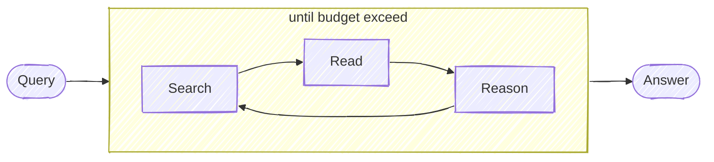

# DeepResearch

[Official UI](https://search.jina.ai/) | [UI Code](https://github.com/jina-ai/deepsearch-ui) | [Stable API](https://jina.ai/deepsearch) | [Blog](https://jina.ai/news/a-practical-guide-to-implementing-deepsearch-deepresearch)

Keep searching, reading webpages, reasoning until an answer is found (or the token budget is exceeded). Useful for deeply investigating a query.

> [!IMPORTANT]  
> Unlike OpenAI/Gemini/Perplexity's "Deep Research", we focus solely on **finding the right answers via our iterative process**. We don't optimize for long-form articles, that's a **completely different problem** – so if you need quick, concise answers from deep search, you're in the right place. If you're looking for AI-generated long reports like OpenAI/Gemini/Perplexity does, this isn't for you.



## [Blog Post](https://jina.ai/news/a-practical-guide-to-implementing-deepsearch-deepresearch)

Whether you like this implementation or not, I highly recommend you to read DeepSearch/DeepResearch implementation guide I wrote, which gives you a gentle intro to this topic.

- [English Part I](https://jina.ai/news/a-practical-guide-to-implementing-deepsearch-deepresearch), [Part II](https://jina.ai/news/snippet-selection-and-url-ranking-in-deepsearch-deepresearch)
- [中文微信公众号 第一讲](https://mp.weixin.qq.com/s/-pPhHDi2nz8hp5R3Lm_mww), [第二讲](https://mp.weixin.qq.com/s/apnorBj4TZs3-Mo23xUReQ)
- [日本語: DeepSearch/DeepResearch 実装の実践ガイド](https://jina.ai/ja/news/a-practical-guide-to-implementing-deepsearch-deepresearch)

## Try it Yourself

We host an online deployment of this **exact** codebase, which allows you to do a vibe-check; or use it as daily productivity tools.

https://search.jina.ai

The official API is also available for you to use:

```
https://deepsearch.jina.ai/v1/chat/completions
```

Learn more about the API at https://jina.ai/deepsearch


## Install

```bash
git clone https://github.com/jina-ai/node-DeepResearch.git
cd node-DeepResearch
npm install
```

[安装部署视频教程 on Youtube](https://youtu.be/vrpraFiPUyA)

It is also available on npm but not recommended for now, as the code is still under active development.


## Usage

We support multiple LLM providers for reasoning: **Gemini**, **OpenAI**, **Anthropic**, **Groq**, and [LocalLLM](#use-local-llm). We use [Jina Reader](https://jina.ai/reader) for searching and reading webpages - you can get a free API key with 1M tokens from jina.ai.

```bash
# Required: Jina API key for search/read
export JINA_API_KEY=jina_...  # free jina api key, get from https://jina.ai/reader

# Choose your LLM provider (default: gemini)
export LLM_PROVIDER=gemini  # options: gemini, openai, anthropic, groq

# Set the API key for your chosen provider
export GEMINI_API_KEY=...     # for gemini (default)
# export OPENAI_API_KEY=...   # for openai
# export ANTHROPIC_API_KEY=... # for anthropic
# export GROQ_API_KEY=...     # for groq

npm run dev $QUERY
```

### Supported LLM Providers

| Provider | Default Model | Environment Variable |
|----------|---------------|---------------------|
| Gemini (default) | `gemini-2.5-flash-lite` | `GEMINI_API_KEY` |
| OpenAI | `gpt-4o-mini` | `OPENAI_API_KEY` |
| Anthropic | `claude-sonnet-4-20250514` | `ANTHROPIC_API_KEY` |
| Groq | `llama-3.3-70b-versatile` | `GROQ_API_KEY` |

### Official Site

You can try it on [our official site](https://search.jina.ai).

### Official API

You can also use [our official DeepSearch API](https://jina.ai/deepsearch):

```
https://deepsearch.jina.ai/v1/chat/completions
```

You can use it with any OpenAI-compatible client. 

For the authentication Bearer, API key, rate limit, get from https://jina.ai/deepsearch.

#### Client integration guidelines

If you are building a web/local/mobile client that uses `Jina DeepSearch API`, here are some design guidelines:
- Our API is fully compatible with [OpenAI API schema](https://platform.openai.com/docs/api-reference/chat/create), this should greatly simplify the integration process. The model name is `ascend-deepsearch-v1`.
- Our DeepSearch API is a reasoning+search grounding LLM, so it's best for questions that require deep reasoning and search.
- Two special tokens are introduced `<think>...</think>`. Please render them with care.
- Citations are often provided, and in [Github-flavored markdown footnote format](https://github.blog/changelog/2021-09-30-footnotes-now-supported-in-markdown-fields/), e.g. `[^1]`, `[^2]`, ...
- Guide the user to get a Jina API key from https://jina.ai, with 1M free tokens for new API key.
- There are rate limits, [between 10RPM to 30RPM depending on the API key tier](https://jina.ai/contact-sales#rate-limit).
- [Download Jina AI logo here](https://jina.ai/logo-Jina-1024.zip)

## Demo
> was recorded with `gemini-1.5-flash`, the latest `gemini-2.0-flash` leads to much better results!

Query: `"what is the latest blog post's title from jina ai?"`
3 steps; answer is correct!


Query: `"what is the context length of readerlm-v2?"`
2 steps; answer is correct!


Query: `"list all employees from jina ai that u can find, as many as possible"` 
11 steps; partially correct! but im not in the list :(


Query: `"who will be the biggest competitor of Jina AI"` 
42 steps; future prediction kind, so it's arguably correct! atm Im not seeing `weaviate` as a competitor, but im open for the future "i told you so" moment.


More examples:

```
# example: no tool calling 
npm run dev "1+1="
npm run dev "what is the capital of France?"

# example: 2-step
npm run dev "what is the latest news from Jina AI?"

# example: 3-step
npm run dev "what is the twitter account of jina ai's founder"

# example: 13-step, ambiguious question (no def of "big")
npm run dev "who is bigger? cohere, jina ai, voyage?"

# example: open question, research-like, long chain of thoughts
npm run dev "who will be president of US in 2028?"
npm run dev "what should be jina ai strategy for 2025?"
```

## Use Local LLM

> Note, not every LLM works with our reasoning flow, we need those who support structured output (sometimes called JSON Schema output, object output) well. Feel free to purpose a PR to add more open-source LLMs to the working list.

If you use Ollama or LMStudio, you can redirect the reasoning request to your local LLM by setting the following environment variables:

```bash
export LLM_PROVIDER=openai  # yes, that's right - for local llm we still use openai client
export OPENAI_BASE_URL=http://127.0.0.1:1234/v1  # your local llm endpoint
export OPENAI_API_KEY=whatever  # random string would do, as we don't use it (unless your local LLM has authentication)
export DEFAULT_MODEL_NAME=qwen2.5-7b  # your local llm model name
```


## OpenAI-Compatible Server API

If you have a GUI client that supports OpenAI API (e.g. [CherryStudio](https://docs.cherry-ai.com/), [Chatbox](https://github.com/Bin-Huang/chatbox)) , you can simply config it to use this server.


Start the server:
```bash
# Without authentication
npm run serve

# With authentication (clients must provide this secret as Bearer token)
npm run serve --secret=your_secret_token
```

The server will start on http://localhost:3000 with the following endpoint:

### POST /v1/chat/completions
```bash
# Without authentication
curl http://localhost:3000/v1/chat/completions \
  -H "Content-Type: application/json" \
  -d '{
    "model": "ascend-deepsearch-v1",
    "messages": [
      {
        "role": "user",
        "content": "Hello!"
      }
    ]
  }'

# With authentication (when server is started with --secret)
curl http://localhost:3000/v1/chat/completions \
  -H "Content-Type: application/json" \
  -H "Authorization: Bearer your_secret_token" \
  -d '{
    "model": "ascend-deepsearch-v1",
    "messages": [
      {
        "role": "user",
        "content": "Hello!"
      }
    ],
    "stream": true
  }'
```

### API Parameters

The API supports the following additional parameters beyond the standard OpenAI schema:

| Parameter | Type | Description |
|-----------|------|-------------|
| `llm_provider` | string | Override the default LLM provider at runtime. Options: `gemini`, `openai`, `anthropic`, `groq`, `vertex` |
| `llm_model` | string | Override the default model for the selected provider (e.g., `gemini-2.5-pro`, `gpt-4o`, `claude-sonnet-4-20250514`) |
| `reasoning_effort` | string | Control search depth: `low` (75k tokens), `medium` (500k tokens), `high` (1M tokens) |
| `budget_tokens` | number | Set exact token budget for the research |
| `max_attempts` | number | Maximum retry attempts for answer evaluation |
| `boost_hostnames` | string[] | Prioritize results from these domains |
| `bad_hostnames` | string[] | Exclude results from these domains |
| `only_hostnames` | string[] | Only search within these domains |
| `no_direct_answer` | boolean | Force research even for simple questions |
| `with_images` | boolean | Include relevant images in the response |
| `language_code` | string | Language for the response |
| `search_language_code` | string | Language for search queries |

**Example with runtime provider override:**
```bash
curl http://localhost:3000/v1/chat/completions \
  -H "Content-Type: application/json" \
  -d '{
    "model": "ascend-deepsearch-v1",
    "messages": [{"role": "user", "content": "What is quantum computing?"}],
    "llm_provider": "anthropic",
    "llm_model": "claude-sonnet-4-20250514",
    "reasoning_effort": "medium"
  }'
```

Response format:
```json
{
  "id": "chatcmpl-123",
  "object": "chat.completion",
  "created": 1677652288,
  "model": "ascend-deepsearch-v1",
  "system_fingerprint": "fp_44709d6fcb",
  "choices": [{
    "index": 0,
    "message": {
      "role": "assistant",
      "content": "YOUR FINAL ANSWER"
    },
    "logprobs": null,
    "finish_reason": "stop"
  }],
  "usage": {
    "prompt_tokens": 9,
    "completion_tokens": 12,
    "total_tokens": 21
  }
}
```

### Error Handling

When there's a configuration error (e.g., missing API key for a provider), the API returns a detailed error response:

```json
{
  "choices": [{
    "message": {
      "role": "assistant",
      "content": "{...error details...}",
      "type": "error"
    },
    "finish_reason": "error"
  }],
  "error": {
    "error": "ProviderConfigError",
    "code": "MISSING_API_KEY",
    "message": "ANTHROPIC_API_KEY environment variable is not set...",
    "provider": "anthropic",
    "model": "claude-sonnet-4-20250514",
    "availableProviders": ["gemini", "openai", "anthropic", "groq", "vertex"]
  }
}
```

For streaming responses (stream: true), the server sends chunks in this format:
```json
{
  "id": "chatcmpl-123",
  "object": "chat.completion.chunk",
  "created": 1694268190,
  "model": "ascend-deepsearch-v1",
  "system_fingerprint": "fp_44709d6fcb",
  "choices": [{
    "index": 0,
    "delta": {
      "content": "..."
    },
    "logprobs": null,
    "finish_reason": null
  }]
}
```

Note: The think content in streaming responses is wrapped in XML tags:
```
<think>
[thinking steps...]
</think>
[final answer]
```


## Docker Setup

### Build Docker Image
To build the Docker image for the application, run the following command:
```bash
docker build -t deepresearch:latest .
```

### Run Docker Container
To run the Docker container, use the following command:
```bash
docker run -p 3000:3000 --env GEMINI_API_KEY=your_gemini_api_key --env JINA_API_KEY=your_jina_api_key deepresearch:latest
```

### Docker Compose
You can also use Docker Compose to manage multi-container applications. To start the application with Docker Compose, run:
```bash
docker-compose up
```

## How Does it Work?

Not sure a flowchart helps, but here it is:

```mermaid
flowchart TD
    Start([Start]) --> Init[Initialize context & variables]
    Init --> ExtractURLs[Extract URLs From Messages]
    ExtractURLs --> CheckBudget{Token Budget<br/>NOT Exceeded?}
    
    CheckBudget -->|Yes| StepSetup[Set Up Step And Select Current Question]
    CheckBudget -->|No| ExitLoop[Exit Loop]
    
    StepSetup --> IsFirstStep{Is First Step?}
    IsFirstStep -->|Yes| SetupEvaluation[Set Up Evaluation Metrics]
    IsFirstStep -->|No| IsSubQuestion{Is Sub Question?}
    
    IsSubQuestion -->|Yes| EmptyEvaluation[Set Empty Evaluation Metrics]
    IsSubQuestion -->|No| ContinueSetup[Continue Setup]
    
    SetupEvaluation --> FreshnessCheck{Step 1 &<br/>Freshness Eval?}
    EmptyEvaluation --> ContinueSetup
    
    FreshnessCheck -->|Yes| DisableFlags[Disable Answer & Reflect]
    FreshnessCheck -->|No| ContinueSetup
    DisableFlags --> ContinueSetup
    
    ContinueSetup --> ControlActions[Control Action Availability]
    ControlActions --> GenPrompt[Generate Prompt And Schema]
    GenPrompt --> ModelGen[Generate Response Using LLM]
    ModelGen --> TrackAction[Track Action And Reset Flags]
    TrackAction --> ActionSwitch{Select Action Type}
    
    %% Answer Flow
    ActionSwitch -->|Answer| AnswerCheck{Step 1 &<br/>!noDirectAnswer?}
    AnswerCheck -->|Yes| MarkTrivial[Mark Trivial And Break]
    AnswerCheck -->|No| EvalAnswer[Evaluate Answer]
    
    EvalAnswer --> IsOriginal{Is Original Question?}
    IsOriginal -->|Yes| EvalPass{Evaluation Pass?}
    IsOriginal -->|No| SubPass{Evaluation Pass?}
    
    EvalPass -->|Yes| MarkFinal[Mark Final And Break]
    EvalPass -->|No| DecrementEvals[Decrement Evals & Add To PIP]
    
    DecrementEvals --> EvalsExhausted{All Evals Exhausted?}
    EvalsExhausted -->|Yes| MarkNotFinal[Mark Not Final And Break]
    EvalsExhausted -->|No| AnalyzeErrors[Analyze Errors & Disable Answer]
    
    SubPass -->|Yes| StoreKnowledge[Store Knowledge & Remove Gap]
    SubPass -->|No| ContinueLoop1[Continue Loop]
    AnalyzeErrors --> ContinueLoop1
    StoreKnowledge --> ContinueLoop1
    
    MarkTrivial --> ExitLoop
    MarkFinal --> ExitLoop
    MarkNotFinal --> ExitLoop
    
    %% Reflect Flow
    ActionSwitch -->|Reflect| DedupReflect[Deduplicate Questions]
    DedupReflect --> NewQs{New Unique Questions?}
    NewQs -->|Yes| AddGaps[Add To Gaps]
    NewQs -->|No| LogFail[Log Failure]
    AddGaps --> DisableReflect[Disable Reflect]
    LogFail --> DisableReflect
    DisableReflect --> ContinueLoop2[Continue Loop]
    
    %% Search Flow
    ActionSwitch -->|Search| DedupSearch[Deduplicate Search]
    DedupSearch --> ExecSearch[Execute Search Queries]
    ExecSearch --> TeamCheck{Team >1 &<br/>Multi-subproblems?}
    
    TeamCheck -->|Yes| TeamResearch[Research Plan & Recurse]
    TeamResearch --> AggregateAnswers[Aggregate Answers]
    AggregateAnswers --> TeamBreak[Break Loop]
    TeamBreak --> ExitLoop
    
    TeamCheck -->|No| RewriteQueries[Rewrite Queries]
    RewriteQueries --> ExecRewritten[Execute Rewritten]
    ExecRewritten --> DisableSearch[Disable Search & Answer]
    DisableSearch --> ContinueLoop3[Continue Loop]
    
    %% Visit Flow
    ActionSwitch -->|Visit| NormalizeURLs[Normalize & Filter URLs]
    NormalizeURLs --> ProcessPages[Process Pages]
    ProcessPages --> UpdateVisit[Update Context]
    UpdateVisit --> DisableVisit[Disable Visit]
    DisableVisit --> ContinueLoop4[Continue Loop]
    
    %% Coding Flow
    ActionSwitch -->|Coding| SolveCode[Solve Coding Issue]
    SolveCode --> CodeSuccess{Success?}
    CodeSuccess -->|Yes| StoreSolution[Store Solution]
    CodeSuccess -->|No| LogCodeError[Log Error]
    StoreSolution --> DisableCoding[Disable Coding]
    LogCodeError --> DisableCoding
    DisableCoding --> ContinueLoop5[Continue Loop]
    
    %% Loop Back
    ContinueLoop1 --> StoreContext[Store Context]
    ContinueLoop2 --> StoreContext
    ContinueLoop3 --> StoreContext
    ContinueLoop4 --> StoreContext
    ContinueLoop5 --> StoreContext
    StoreContext --> WaitStep[Wait STEP_SLEEP]
    WaitStep --> CheckBudget
    
    %% Post-Loop Processing
    ExitLoop --> CheckFinal{isFinal?}
    CheckFinal -->|No| BeastMode[Beast Mode]
    CheckFinal -->|Yes| FinalProcessing[Process Final Answer]
    
    BeastMode --> BeastPrompt[Generate Beast Prompt]
    BeastPrompt --> BeastModel[Generate Beast Response]
    BeastModel --> SetFinal[Set isFinal=true]
    SetFinal --> FinalProcessing
    
    %% Final Assembly
    FinalProcessing --> IsTrivial{Trivial?}
    IsTrivial -->|Yes| BuildSimple[Build Simple MD]
    IsTrivial -->|No| IsAggregated{Aggregated?}
    
    IsAggregated -->|Yes| BuildAggregate[Concat Answers & Filter Images]
    IsAggregated -->|No| FinalizeAnswer[Finalize Answer]
    
    FinalizeAnswer --> BuildReferences[Build References]
    BuildReferences --> WithImages{With Images?}
    WithImages -->|Yes| BuildImageRefs[Build Image References]
    WithImages -->|No| PrepareReturn[Prepare Return]
    
    BuildImageRefs --> PrepareReturn
    BuildSimple --> PrepareReturn
    BuildAggregate --> PrepareReturn
    PrepareReturn --> End([End])
```


