# Budget Tracking & Main Loop Flowchart

## Complete Flow Diagram

```mermaid
flowchart TD
    Start([getResponse Function Entry]) --> Init["Initialize Variables<br/>TokenTracker with budget<br/>regularBudget = budget * 0.85<br/>gaps = question<br/>allKnowledge = empty"]
    
    Init --> ExtractURLs[Extract URLs from Messages]
    ExtractURLs --> BudgetCheck{"Token Budget Check<br/>usage less than regularBudget?<br/>Line 518"}
    
    BudgetCheck -->|PASS| StepSetup["Step Setup<br/>Increment step/totalStep<br/>Calculate budget percentage<br/>Select currentQuestion<br/>Lines 519-526"]
    
    StepSetup --> EvalSetup{Is Step 1?}
    EvalSetup -->|Yes| SetupEval["Setup Evaluation Metrics<br/>evaluateQuestion<br/>Set numEvalsRequired<br/>Lines 531-541"]
    EvalSetup -->|No| CheckSubQ{Is Sub-Question?}
    CheckSubQ -->|Yes| EmptyEval["Empty Evaluation Metrics<br/>Line 543"]
    CheckSubQ -->|No| ContinueSetup[Continue Setup]
    SetupEval --> ContinueSetup
    EmptyEval --> ContinueSetup
    
    ContinueSetup --> ActionControl["Action Availability Control<br/>Check freshness<br/>Rank/filter URLs<br/>Set allow flags<br/>Lines 546-568"]
    
    ActionControl --> GenPrompt["Generate Prompt and Schema<br/>Build system prompt<br/>Compose messages<br/>Get agent schema<br/>Lines 571-585"]
    
    GenPrompt --> LLMCall["LLM Generate Object<br/>model: agent<br/>Track token usage<br/>Lines 586-592"]
    
    LLMCall --> TrackAction["Track Action<br/>Line 602"]
    TrackAction --> ResetFlags["Reset allow Flags<br/>Lines 604-609"]
    
    ResetFlags --> ActionSwitch{Action Type?}
    
    ActionSwitch -->|answer| AnswerAction["Answer Action<br/>Lines 612-772"]
    ActionSwitch -->|reflect| ReflectAction["Reflect Action<br/>Lines 773-803"]
    ActionSwitch -->|search| SearchAction["Search Action<br/>Lines 804-930"]
    ActionSwitch -->|visit| VisitAction["Visit Action<br/>Lines 931-986"]
    ActionSwitch -->|coding| CodingAction["Coding Action<br/>Lines 987-1023"]
    
    AnswerAction --> AnswerCheck{"Step 1 and<br/>No Refs?"}
    AnswerCheck -->|Yes| TrivialBreak["Mark Trivial<br/>Break Loop<br/>Line 621"]
    AnswerCheck -->|No| EvalAnswer["Evaluate Answer<br/>Track token usage<br/>Lines 653-663"]
    
    EvalAnswer --> IsOriginal{Is Original Question?}
    IsOriginal -->|Yes| EvalResult{Evaluation Pass?}
    IsOriginal -->|No| SubQResult{Evaluation Pass?}
    
    EvalResult -->|Yes| SuccessBreak["Mark isFinal = true<br/>Break Loop<br/>Line 685"]
    EvalResult -->|No| DecrEval["Decrement numEvalsRequired<br/>Add to finalAnswerPIP<br/>Lines 688-697"]
    
    DecrEval --> EvalExhausted{All Evals Exhausted?}
    EvalExhausted -->|Yes| BeastBreak["Mark isFinal = false<br/>Break Loop<br/>Line 702"]
    EvalExhausted -->|No| ErrorAnalysis["Analyze Errors<br/>Add to knowledge<br/>Reset diary context<br/>Lines 718-746"]
    
    SubQResult -->|Yes| AddKnowledge["Add to allKnowledge<br/>Remove from gaps<br/>Lines 764-771"]
    SubQResult -->|No| ContinueLoop1[Continue Loop]
    ErrorAnalysis --> ContinueLoop1
    AddKnowledge --> ContinueLoop1
    
    ReflectAction --> DedupReflect["Deduplicate Questions<br/>Track token usage<br/>Line 774"]
    DedupReflect --> NewQuestions{New Questions Found?}
    NewQuestions -->|Yes| AddGaps["Add to gaps queue<br/>Update diary context<br/>Lines 785-790"]
    NewQuestions -->|No| ReflectFail["Log Failure<br/>Lines 793-801"]
    AddGaps --> DisableReflect["Disable Reflect<br/>Line 803"]
    ReflectFail --> DisableReflect
    DisableReflect --> ContinueLoop2[Continue Loop]
    
    SearchAction --> DedupSearch["Deduplicate Search<br/>Track token usage<br/>Line 806"]
    DedupSearch --> ExecSearch["Execute Search Queries<br/>Track token usage<br/>Lines 809-820"]
    ExecSearch --> TeamCheck{"teamSize greater than 1 and<br/>Multiple Subproblems?"}
    
    TeamCheck -->|Yes| TeamResearch["Research Plan<br/>Recursive getResponse Calls<br/>Share tokenTracker<br/>Lines 825-840"]
    TeamResearch --> Aggregate["Aggregate Answers<br/>Mark isFinal = true<br/>isAggregated = true<br/>Lines 842-851"]
    Aggregate --> TeamBreak["Break Loop<br/>Line 862"]
    
    TeamCheck -->|No| RewriteQuery["Rewrite Queries<br/>Track token usage<br/>Lines 870-878"]
    RewriteQuery --> ExecRewritten["Execute Rewritten Searches<br/>Track token usage<br/>Lines 884-925"]
    ExecRewritten --> DisableSearch["Disable Search and Answer<br/>Lines 927-930"]
    DisableSearch --> ContinueLoop3[Continue Loop]
    
    VisitAction --> NormalizeURLs["Normalize and Filter URLs<br/>Line 933-937"]
    NormalizeURLs --> ProcessURLs["Process URLs<br/>Extract knowledge/images<br/>Track token usage<br/>Lines 943-955"]
    ProcessURLs --> UpdateVisit["Update diary context<br/>Line 957-962"]
    UpdateVisit --> DisableRead["Disable Read<br/>Line 986"]
    DisableRead --> ContinueLoop4[Continue Loop]
    
    CodingAction --> SolveCode["Solve Coding Issue<br/>Track token usage<br/>Lines 990-1006"]
    SolveCode --> CodeSuccess{Success?}
    CodeSuccess -->|Yes| AddCode["Add Solution to Knowledge<br/>Line 991-997"]
    CodeSuccess -->|No| CodeError["Log Error<br/>Lines 1008-1019"]
    AddCode --> DisableCoding["Disable Coding<br/>Line 1021"]
    CodeError --> DisableCoding
    DisableCoding --> ContinueLoop5[Continue Loop]
    
    ContinueLoop1 --> StoreContext
    ContinueLoop2 --> StoreContext
    ContinueLoop3 --> StoreContext
    ContinueLoop4 --> StoreContext
    ContinueLoop5 --> StoreContext
    
    StoreContext["Store Context<br/>Track token usage<br/>Lines 1025-1032"] --> RateLimit["Wait STEP_SLEEP<br/>Line 1033"]
    RateLimit --> BudgetCheck
    
    BudgetCheck -->|FAIL| ExitLoop["Exit Loop<br/>Line 1034"]
    
    TrivialBreak --> ExitLoop
    SuccessBreak --> ExitLoop
    BeastBreak --> ExitLoop
    TeamBreak --> ExitLoop
    
    ExitLoop --> CheckFinal{"isFinal equals true?"}
    
    CheckFinal -->|No| BeastMode["Beast Mode<br/>Lines 1036-1076"]
    CheckFinal -->|Yes| FinalProcessing
    
    BeastMode --> BeastPrompt["Generate Beast Mode Prompt<br/>beastMode: true<br/>Only answer action<br/>Lines 1045-1057"]
    BeastPrompt --> BeastLLM["LLM Generate<br/>model: agentBeastMode<br/>Track token usage<br/>Lines 1061-1067"]
    BeastLLM --> SetFinal["Set isFinal = true<br/>Line 1074"]
    SetFinal --> FinalProcessing
    
    FinalProcessing["Final Answer Processing<br/>Lines 1078-1134"] --> TrivialCheck{trivialQuestion?}
    
    TrivialCheck -->|Yes| SimpleMD["Build Markdown<br/>Skip finalization<br/>Line 1081"]
    TrivialCheck -->|No| AggCheck{isAggregated?}
    
    AggCheck -->|Yes| AggregateAnswers["Concatenate Answers<br/>Filter Images<br/>Lines 1124-1133"]
    AggCheck -->|No| Finalize["Finalize Answer<br/>Track token usage<br/>Lines 1083-1096"]
    
    Finalize --> BuildRefs["Build References<br/>Track token usage<br/>Lines 1098-1110"]
    BuildRefs --> UpdateRefs["Update References<br/>Line 1111"]
    UpdateRefs --> BuildImageRefs{withImages?}
    
    BuildImageRefs -->|Yes| ImageRefs["Build Image References<br/>Track token usage<br/>Lines 1116-1122"]
    BuildImageRefs -->|No| ReturnPrep
    ImageRefs --> ReturnPrep
    SimpleMD --> ReturnPrep
    AggregateAnswers --> ReturnPrep
    
    ReturnPrep["Prepare Return Values<br/>Lines 1136-1145"] --> Return([Return Result<br/>with context and URLs])
    
    style BudgetCheck fill:#ff9999,stroke:#333,stroke-width:3px
    style BeastMode fill:#ffcc99,stroke:#333,stroke-width:2px
    style LLMCall fill:#99ccff,stroke:#333,stroke-width:2px
    style BeastLLM fill:#ffcc99,stroke:#333,stroke-width:2px
    style ExitLoop fill:#99ff99,stroke:#333,stroke-width:2px
    style TrivialBreak fill:#ffcccc,stroke:#333,stroke-width:2px
    style SuccessBreak fill:#ccffcc,stroke:#333,stroke-width:2px
    style BeastBreak fill:#ffcccc,stroke:#333,stroke-width:2px
    style TeamBreak fill:#ffcccc,stroke:#333,stroke-width:2px
```

## Budget Tracking Points

The diagram shows token usage tracking at these key points:

1. **LLM Calls** (Blue nodes): All `generator.generateObject()` calls track usage
2. **Evaluation**: `evaluateAnswer()` tracks usage
3. **Search**: `executeSearchQueries()` tracks usage  
4. **Deduplication**: `dedupQueries()` tracks usage
5. **Query Rewriting**: `rewriteQuery()` tracks usage
6. **URL Processing**: `processURLs()` tracks usage
7. **Beast Mode**: Final LLM call tracks usage
8. **Finalization**: `finalizeAnswer()` tracks usage
9. **Reference Building**: `buildReferences()` and `buildImageReferences()` track usage

## Budget Check Decision Points

- **Primary Check** (Red node): Line 518 - Controls loop continuation
- **Budget Calculation**: `regularBudget = tokenBudget * 0.85` (reserves 15% for beast mode)
- **Loop-Back**: After each iteration (line 1033 → 518)
- **Exit Condition**: `tokenUsage >= regularBudget` → exits to beast mode check

## Early Exit Paths

- **Trivial Question** (Pink): Step 1 answer without references
- **Success** (Green): Evaluation passes for original question
- **Evaluation Exhausted** (Pink): All evaluation attempts failed
- **Team Aggregation** (Pink): Team research completed

All early exits bypass the budget re-check and go directly to post-loop processing.

